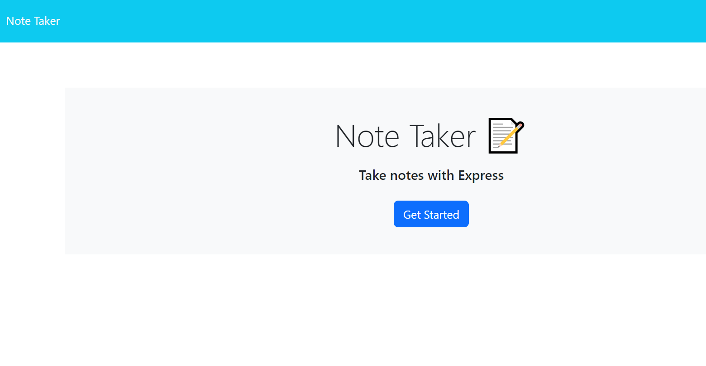

# Note-Taker

## Description 
The Note Taker application provides a straightforward and efficient way for users to organize their thoughts and tasks through an easy-to-use web interface.
The app utilizes a variety of modern web development technologies to provide a seamless note-taking experience. Below is an overview of the key technologies used:

Express.js is used to create the server and handle routing for the API endpoints.
Node.js is used to execute JavaScript code server-side and manage the application's back-end.
UUID is used to assign unique IDs to each note for easy management and retrieval.
File System (fs) Module is used to interact with the file system. In this application, it is used to read and write notes to a JSON file.
Bootstrap is used for styling the application's user interface.

## Usage 
The app has been deployed and can be viewed in a web browser. 

